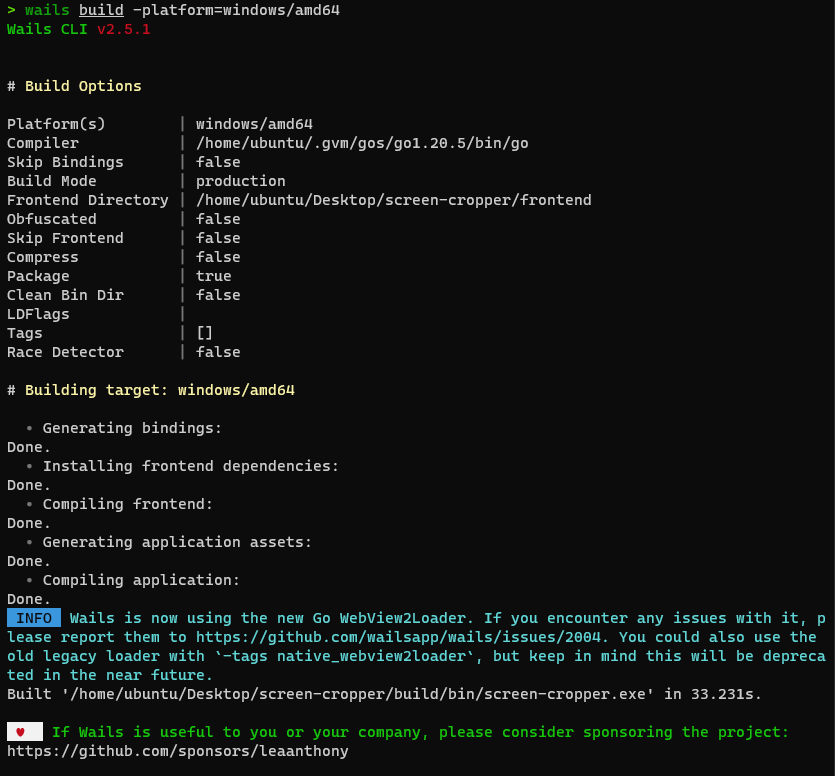
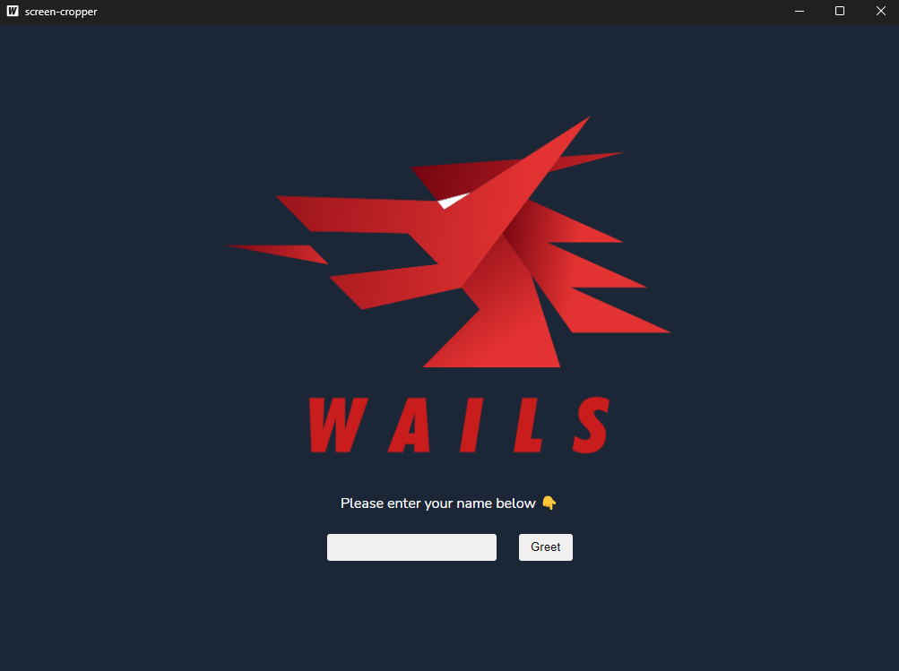

## 前言

這系列主要記錄我使用 Go 開發截圖工具的過程，利用 Wails 框架結合前端框架，輕鬆開發桌面應用程式。

## 1. 安裝 Wails

執行以下指令安裝 Wails：

```shell
go install github.com/wailsapp/wails/v2/cmd/wails@latest
```

## 2. 建立 Wails 專案

-n 參數指定專案名稱，-t 參數指定模板。

```shell
wails init -n screen-cropper -t svelte-ts
```

## 3. 修改 go.mod

這邊把 module 名稱改成 screen-cropper 或是你 github 上的專案名稱。

```go
// go.mod
module screen-cropper  // or 'module github.com/LoveSnowEx/screen-cropper'
```

## 4. Build Wails 專案

執行以下指令，會在 build/bin 下產生一個 screen-cropper.exe 檔案。

```shell
wails build -platform=windows/amd64
```



這樣就完成了，接下來就可以執行 screen-cropper.exe 了。


