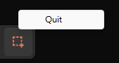

## 1. 新增 icon

在專案目錄下新增一個 assets 資料夾，放入 icon.ico 檔案。

## 2. 新增 systray 的 package

在 pkg/systray 資料夾下新增 systray.go 檔案，並加入以下程式碼：

```go
// pkg/systray/systray.go
package systray

import (
    "context"

    "fyne.io/systray"
)

var (
    done = make(chan struct{}, 1)
)

// Config is the configuration for the systray
type Config struct {
    Title     string
    Tooltip   string
    IconBytes []byte
}

// Run the systray and block until systray is closed
func Run(ctx context.Context, cfg Config) {
    onReady := func() {
        systray.SetIcon(cfg.IconBytes)
        systray.SetTitle(cfg.Title)
        systray.SetTooltip(cfg.Tooltip)

        mQuit := systray.AddMenuItem("Quit", "Quit the app")
        go func() {
            <-mQuit.ClickedCh
            systray.Quit()
        }()
    }

    onExit := func() {
        close(done)
    }

    go func() {
        <-ctx.Done()
        systray.Quit()
    }()

    systray.Run(onReady, onExit)
}

// Done returns a channel that closed when the systray is closed
func Done() <-chan struct{} {
    return done
}

```

接著講解每個部份的設計：

### fyne.io/systray

這邊使用了 fyne.io/systray 套件，可以在 systray 上顯示 icon，並且可以新增 menu。

```go
import (
    "context"

    "fyne.io/systray"
)
```

### Config

```go
type Config struct {
    Title     string
    Tooltip   string
    IconBytes []byte
}
```

Config 是 systray 的設定，包含了 title、tooltip、icon。

### Run

Run 是啟動 systray 的函式，根據傳入的 Config 設定 systray 的 title、tooltip、icon。

```go
systray.SetIcon(cfg.IconBytes)
systray.SetTitle(cfg.Title)
systray.SetTooltip(cfg.Tooltip)
```

設定 systray 的 quit menu，當按下時會關閉 systray。

```go
mQuit := systray.AddMenuItem("Quit", "Quit the app")
go func() {
    <-mQuit.ClickedCh
    systray.Quit()
}()
```

並且在 systray 結束時關閉 done channel。

除此之外，Run 還會監聽 ctx.Done()，當 ctx.Done() 被關閉時，也會關閉 systray。

### Done

Done 是一個 channel，當 systray 結束時，會關閉這個 channel。主要是為了讓其他地方可以監聽 systray 是否結束。

```go
func Done() <-chan struct{} {
    return done
}
```

## 3. 修改 app.go

將 app.go 修改成以下程式碼：

```go
// app.go
package main

import (
    "context"
    "fmt"

    _ "embed"

    "github.com/LoveSnowEx/screen-cropper/pkg/systray"
    "github.com/wailsapp/wails/v2/pkg/runtime"
)

//go:embed assets/icon.ico
var icon []byte

// App struct
type App struct {
    ctx context.Context
}

// NewApp creates a new App application struct
func NewApp() *App {
    return &App{}
}

func (a *App) bindSystray() {
    // Run the systray
    go systray.Run(a.ctx, systray.Config{
        Title:     "Screen Cropper",
        Tooltip:   "Screen Cropper",
        IconBytes: icon,
    })

    // Quit the app when the systray is closed
    go func() {
        <-systray.Done()
        runtime.Quit(a.ctx)
    }()
}

// startup is called when the app starts. The context is saved
// so we can call the runtime methods
func (a *App) startup(ctx context.Context) {
    a.ctx = ctx
    a.bindSystray()
}

// Greet returns a greeting for the given name
func (a *App) Greet(name string) string {
    return fmt.Sprintf("Hello %s, It's show time!", name)
}

```

以下是修改的部份：

### Embed

embed 是 Go 1.16 新增的功能，可以將檔案內嵌到程式碼中，在 build 時會一起編譯。

以下是使用方式：
在檔案的最上方加上 `//go:embed` 註解，並在註解後面加上檔案路徑。
這邊我們將 icon.ico 內嵌到程式碼中。

```go
//go:embed assets/icon.ico
var icon []byte
```

### bindSystray

bindSystray 會啟動 systray，並且監聽 systray.Done()，當 systray 結束時，會呼叫 runtime.Quit() 透過 context 關閉 app。

```go
func (a *App) bindSystray() {
    // Run the systray
    go systray.Run(a.ctx, systray.Config{
        Title:     "Screen Cropper",
        Tooltip:   "Screen Cropper",
        IconBytes: icon,
    })

    // Quit the app when the systray is closed
    go func() {
        <-systray.Done()
        runtime.Quit(a.ctx)
    }()
}
```

### startup

在 startup 中，我們會將 context 存起來，並且呼叫 bindSystray 啟動 systray。

```go
func (a *App) startup(ctx context.Context) {
    a.ctx = ctx
    a.bindSystray()
}
```

## 4. 重新 build 專案

重新 build 專案，並且執行。

> 這邊我們使用 -s 參數，跳過前端的 build，因為我們只有更動後端的程式碼。

```bash
wails build -platform=windows/amd64 -s
```

執行後，可以看到 systray 已經顯示在 taskbar 上了。
對 icon 按右鍵，可以看到 Quit 的 menu。


