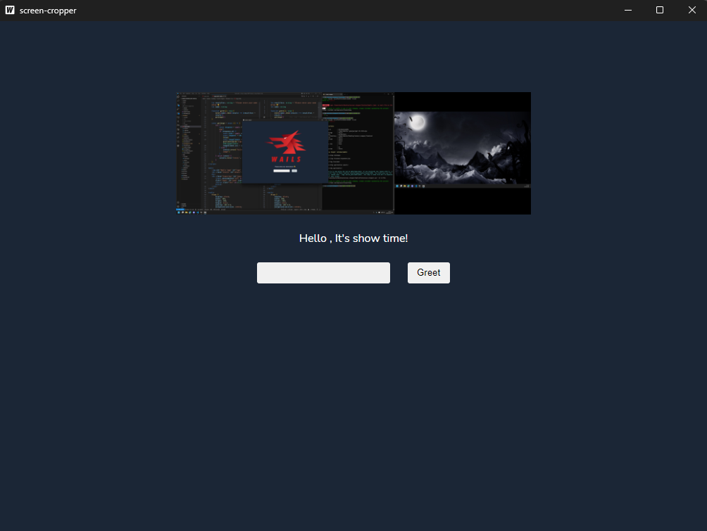

## 1. 建立 screen 的 package

這個 package 用來處理螢幕截圖，並且將截圖結果存到 buffer 裡面。

```go
// pkg/screen/screen.go
package screen

import (
    "bytes"
    "image"
    "image/png"
    "io"
    "sync"

    "github.com/kbinani/screenshot"
)

const defaultBufferSize = 1 << 24 // 16MB

type Screen interface {
    Capture() error
    Reader() io.Reader
}

type screen struct {
    mu    sync.Mutex
    bound image.Rectangle
    buf   []byte
}

// NewScreen returns a new screen
func NewScreen(bound image.Rectangle) Screen {
    return &screen{
        bound: bound,
        buf:   make([]byte, 0, defaultBufferSize),
    }
}

// Capture captures the screen
func (s *screen) Capture() error {
    s.mu.Lock()
    defer s.mu.Unlock()
    img, err := screenshot.CaptureRect(s.bound)
    if err != nil {
        return err
    }
    s.buf = s.buf[:0]
    buf := bytes.NewBuffer(s.buf)
    if err := png.Encode(buf, img); err != nil {
        return err
    }
    s.buf = buf.Bytes()
    return nil
}

// Reader returns a reader for the cached image
func (s *screen) Reader() io.Reader {
    s.mu.Lock()
    defer s.mu.Unlock()
    return bytes.NewReader(s.buf)
}

// MaxBound returns the maximum bounds of all displays
func MaxBound() image.Rectangle {
    minX, minY, maxX, maxY := 0, 0, 0, 0
    n := screenshot.NumActiveDisplays()

    for i := 0; i < n; i++ {
        bounds := screenshot.GetDisplayBounds(i)
        if bounds.Min.X < minX {
            minX = bounds.Min.X
        }
        if bounds.Min.Y < minY {
            minY = bounds.Min.Y
        }
        if bounds.Max.X > maxX {
            maxX = bounds.Max.X
        }
        if bounds.Max.Y > maxY {
            maxY = bounds.Max.Y
        }
    }
    return image.Rect(minX, minY, maxX, maxY)
}
```

接著講解每個部份的設計：

### Screen interface

```go
type Screen interface {
    Capture() error
    Reader() io.Reader
}
```

Screen interface 定義了兩個方法，Capture() 用來進行螢幕截圖，Reader() 用來取得截圖結果的 io.Reader。

### screen struct

```go
type screen struct {
    mu    sync.Mutex
    bound image.Rectangle
    buf   []byte
}
```

screen struct 定義了三個欄位，分別是：

- mu: 用來保護 buf 的 mutex
- bound: 截圖的範圍
- buf: 截圖的結果

> 這裡我們使用了 sync.Mutex 來保護 buf，為了避免在截圖的時候，有其它的 goroutine 正在讀取 buf。

### NewScreen()

```go
const defaultBufferSize = 1 << 24 // 16MB

func NewScreen(bound image.Rectangle) Screen {
    return &screen{
        bound: bound,
        buf:   make([]byte, 0, defaultBufferSize),
    }
}
```

NewScreen() 用來建立 screen，並且初始化 buf 的大小。
buf 的大小我設為 16MB，這是一個常見的圖片大小。

### Capture()

```go
func (s *screen) Capture() error {
    s.mu.Lock()
    defer s.mu.Unlock()
    img, err := screenshot.CaptureRect(s.bound)
    if err != nil {
        return err
    }
    s.buf = s.buf[:0]
    buf := bytes.NewBuffer(s.buf)
    if err := png.Encode(buf, img); err != nil {
        return err
    }
    s.buf = buf.Bytes()
    return nil
}
```

Capture() 用來截圖，並且將結果存到 buf 裡面。
這裡我們使用了 [kbinani/screenshot](github.com/kbinani/screenshot) 來截圖。

### Reader()

```go
func (s *screen) Reader() io.Reader {
    s.mu.Lock()
    defer s.mu.Unlock()
    return bytes.NewReader(s.buf)
}
```

Reader() 用來取得截圖結果的 io.Reader。

### MaxBound()

```go
func MaxBound() image.Rectangle {
    minX, minY, maxX, maxY := 0, 0, 0, 0
    n := screenshot.NumActiveDisplays()

    for i := 0; i < n; i++ {
        bounds := screenshot.GetDisplayBounds(i)
        if bounds.Min.X < minX {
            minX = bounds.Min.X
        }
        if bounds.Min.Y < minY {
            minY = bounds.Min.Y
        }
        if bounds.Max.X > maxX {
            maxX = bounds.Max.X
        }
        if bounds.Max.Y > maxY {
            maxY = bounds.Max.Y
        }
    }
    return image.Rect(minX, minY, maxX, maxY)
}
```

MaxBound() 用來取得所有螢幕的最大範圍。這個範圍就是我們要截圖的範圍。

## 2. 將 screen 嵌入到 app 中

```go
// App struct
type App struct {
    ctx    context.Context
    screen screen.Screen
}

// NewApp creates a new App application struct
func NewApp() *App {
    return &App{
        screen: screen.NewScreen(screen.MaxBound()),
    }
}
```

在 App struct 中，我們將 screen 嵌入進來，並且在 NewApp() 中初始化。

## 3. 建立 HTTP asset server

在 pkg/handler/screen.go 中建立 handler：

```go
// pkg/handler/screen.go
package handler

import (
    "io"
    "net/http"

    "github.com/LoveSnowEx/screen-cropper/pkg/screen"
)

// ScreenHandler is a http.Handler that serves the screen image.
type ScreenHandler struct {
    screen screen.Screen
}

// NewScreenHandler creates a new ScreenHandler.
func NewScreenHandler(screen screen.Screen) http.Handler {
    return &ScreenHandler{screen: screen}
}

// ServeHTTP serves the screen image.
func (s *ScreenHandler) ServeHTTP(w http.ResponseWriter, r *http.Request) {
    if r.URL.Path != "/screen.png" {
        http.NotFound(w, r)
        return
    }
    w.Header().Set("Content-Type", "image/png")
    if _, err := io.Copy(w, s.screen.Reader()); err != nil {
        http.Error(w, err.Error(), http.StatusInternalServerError)
    }
}
```

### ScreenHandler struct

```go
type ScreenHandler struct {
    screen screen.Screen
}
```

ScreenHandler struct 定義了一個 screen.Screen 的欄位，用來存放 screen 資訊。

### NewScreenHandler()

```go
func NewScreenHandler(screen screen.Screen) http.Handler {
    return &ScreenHandler{screen: screen}
}
```

NewScreenHandler() 用來建立 ScreenHandler。

### ServeHTTP()

```go
func (s *ScreenHandler) ServeHTTP(w http.ResponseWriter, r *http.Request) {
    if r.URL.Path != "/screen.png" {
        http.NotFound(w, r)
        return
    }
    w.Header().Set("Content-Type", "image/png")
    if _, err := io.Copy(w, s.screen.Reader()); err != nil {
        http.Error(w, err.Error(), http.StatusInternalServerError)
    }
}
```

ServeHTTP() 用來處理 HTTP request，並且將 screen 的結果回傳給 client。

> ServeHTTP() 實作了 http.Handler 的 interface。

### 套用 handler

```go
// main.go
err := wails.Run(&options.App{
    Title:  "screen-cropper",
    Width:  1024,
    Height: 768,
    AssetServer: &assetserver.Options{
        Assets:  assets,
        Handler: handler.NewScreenHandler(app.screen),
    },
    BackgroundColour: &options.RGBA{R: 27, G: 38, B: 54, A: 1},
    OnStartup:        app.startup,
    Bind: []interface{}{
        app,
    },
})
```

在 main.go 中，我們將 handler 套用到 AssetServer 中，讓前端可以透過 HTTP request 取得 screen 的結果。

## 4. 從前端獲取 screen

這邊我們暫時透過呼叫 Greet() 來觸發截圖。
並且透過 HTTP request 來取得截圖後的結果。

### 在 app.go 修改 Greet()

```go
// Greet returns a greeting for the given name
func (a *App) Greet(name string) string {
    go a.screen.Capture()
    return fmt.Sprintf("Hello %s, It's show time!", name)
}
```

在 Greet() 中，我們呼叫 screen.Capture() 來截圖。

### 在 frontend/src/App.svelte 中加入讀取 screen 的程式碼

```js
function greet(): void {
    Greet(name).then((result) => (resultText = result))
    getImage()
}

const getImage = async () => {
    try {
        const response = await fetch("screen.png")
        if (response.ok) {
            const blob = await response.blob()
            const imageUrl = URL.createObjectURL(blob)
            const imageElement = document.getElementById("logo") as HTMLImageElement
            imageElement.src = imageUrl
        } else {
            console.error("failed to fetch image")
        }
    } catch (error) {
        console.error("error:", error)
    }
}
```

在 greet() 中，我們呼叫 getImage()，透過 fetch() 來取得 screen.png，並且將結果顯示在前端。

## 5. 結果

執行結果如下，可以看到 screen.png 已經成功顯示在前端了。


