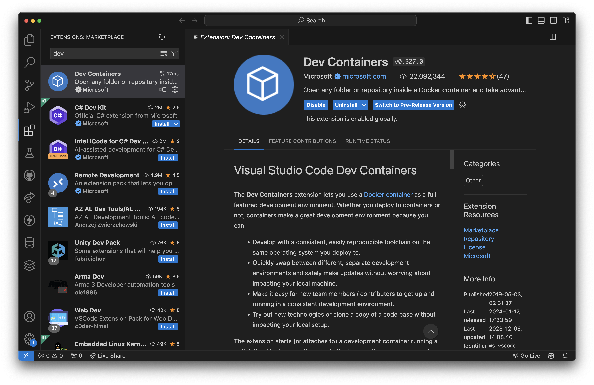
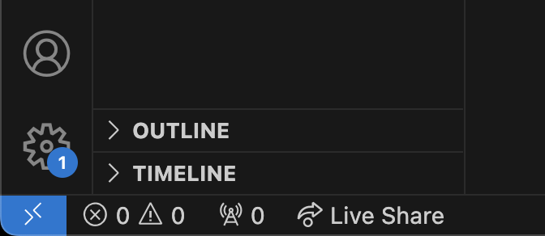
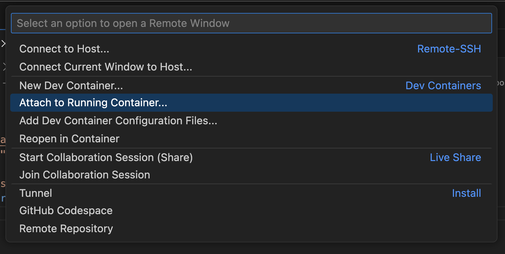
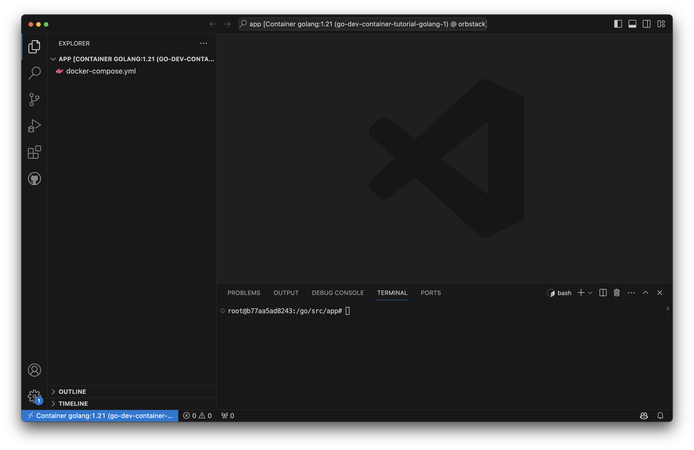
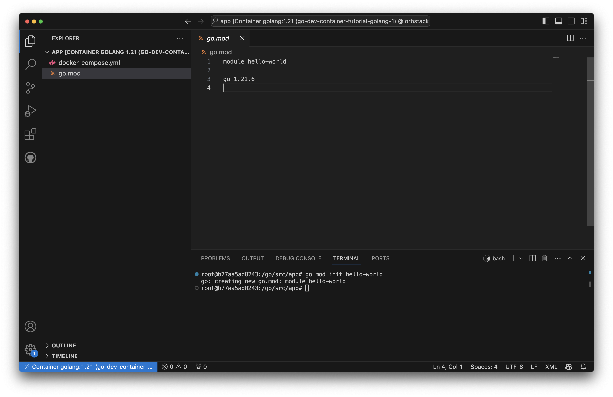
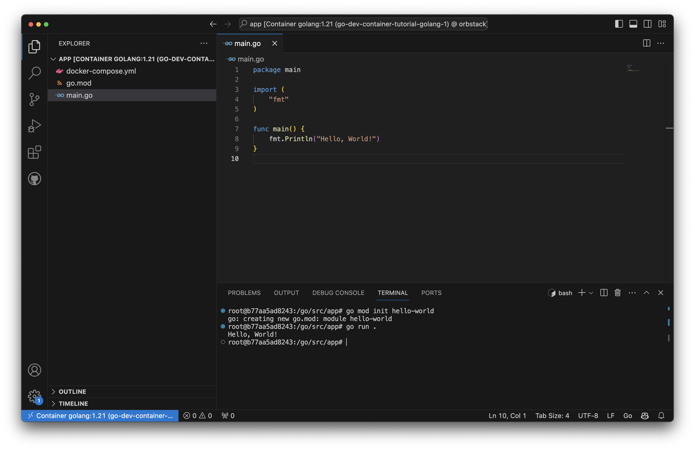

## 前言

Dev Containers 是一個強大的功能，允許我們在 VSCode 中利用 Docker 容器建立開發環境。  
這使得在開發過程中，我們無需在本機安裝各種開發環境，只需調整 Dockerfile 即可輕鬆搞定，相當方便實用。

## 安裝

安裝方式非常簡單，只需在 VS Code 中的 Extensions 搜尋 `Dev Containers` 即可找到。



## 使用

安裝完成後，我們就可以進入容器開發了。  
通常，我會先把容器開好，把專案 mount 到容器中，再將 VS Code 連到容器中進行開發。

以下我會示範如何使用 Dev Containers 來建立並開發一個簡單的 Go 專案。

### 使用 Docker Compose 啟動容器

首先，我們先在專案根目錄建立一個 `docker-compose.yml` 檔案。

```tree
.
└── docker-compose.yml
```

在這邊，我們使用官方的 Golang image，把專案根目錄 mount 到容器中，並且設定工作目錄為 `/go/src/app`。

```yaml
version: '3'
services:
  golang:
    image: golang:1.21
    command: ["bash", "-c", "while true; do sleep 1000; done;"]
    volumes:
      - .:/go/src/app
    working_dir: /go/src/app
```

> 我們使用 `while true; do sleep 1000; done;` 來讓容器不會自動關閉，以便我們可以連線到容器中。

執行以下指令，使用 docker-compose 啟動容器：

```bash
docker compose up -d
```

### 將 VS Code 連到容器

容器啟動後，我們就可以使用 VS Code 連線到容器中進行開發了。  
在 VS Code 左下角有一個的 `><` 圖示，這是 VS Code 的 `Remote Development` 功能，點擊它來開啟遠端開發功能。



在彈出的選單中，選擇 `Dev Container: Attach to Running Container...`，然後選擇剛剛啟動的容器。



接著 VS Code 就會開啟一個新的視窗並連線到容器中，我們就可以在容器中開發了。  
同時左下角也會顯示我們目前處於容器開發環境。



### 嘗試在容器中開發

首先，我們先初始化我們的 Go 專案。

```bash
go mod init hello-world
```



接著我們在專案根目錄建立一個檔案 `main.go`。

```tree
.
├── docker-compose.yml
├── go.mod
└── main.go
```

編輯 `main.go`，並且輸入以下程式碼。

```go
package main

import (
    "fmt"
)

func main() {
    fmt.Println("Hello, World!")
}
```

接著執行 `go run main.go`，就可以看到輸出 `Hello, World!` 了。



## 結語

除了使用官方預設的 image 外，我們還可以自定義 Dockerfile 來安裝所需的開發環境。  
只要能夠成功運行容器，我們就可以利用 Dev Containers 來靈活的進行開發。

Dev Containers 還有一些進階功能，例如使用 `devcontainer.json` 可以設定容器的環境變數、安裝套件等等，這些功能非常強大，但在這裡就不一一介紹了。有興趣的人可以參考[官方文件](https://code.visualstudio.com/docs/devcontainers/create-dev-container#_create-a-devcontainerjson-file)來了解更多詳細資訊。
