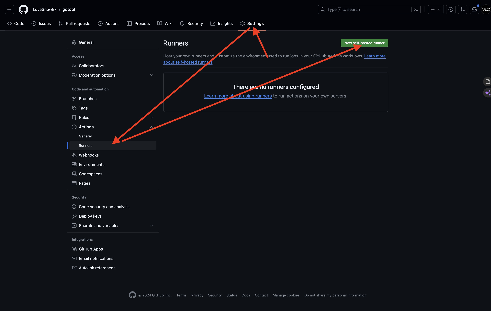
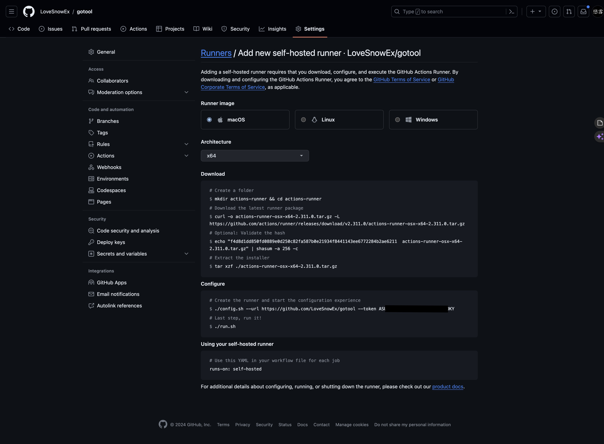

## 前言

除了使用 GitHub 官方提供的 runner，我們也可以自架 runner，這樣可以更好的控制 runner 的環境。  
例如可以讓 runner 在特定的網路環境下執行，或是限制 runner 擁有的權限。

## 安裝

安裝 runner 的方式很簡單，只要在 GitHub 上的 repository 點選 `Settings` -> `Actions` -> `Runner` -> `New self-hosted runner`，就會出現安裝指令，只要複製指令到要安裝 runner 的機器上執行就可以了。





### 安裝問題解決

我是在公司的機器上安裝 runner，環境是  Amazon Linux 2023，安裝過程中遇到了一些問題，因此在這邊紀錄解決方法。

#### 缺少 `shasum`

錯誤：

```paintext
shasum: command not found
```

安裝方式：

```bash
yum install perl-Digest-SHA -y
```

#### 缺少 `Dotnet Core 6.0`

錯誤：

```paintext
Libicu's dependencies is missing for Dotnet Core 6.0
Execute sudo ./bin/installdependencies.sh to install any missing Dotnet Core 6.0 dependencies.
```

安裝方式：

```bash
yum install dotnet-sdk-6.0 -y
```

### runner 設定

執行 `./config.sh` 時，會需要你輸入以下資訊：

- **Group Name**: 這個 runner 所屬的群組名稱，如果沒有特別需求，可以直接按 Enter
- **Runner Name**: 這個 runner 的名稱，可以用來辨識 runner，建議取個有意義的名稱
- **Labels**: 這個 runner 的標籤，可以用來區分 runner，例如可以用來區分 runner 的作用，在 workflow 中可以指定 runner 的標籤，讓 workflow 只會在特定的 runner 上執行
- **Work Folder Name**: runner 的工作目錄名稱，所有 workflow 的執行結果都會放在這個目錄下，預設為 `_work`，建議使用預設值就好

### 啟動 runner

執行 `./run.sh` 就可以啟動 runner 了，如果要停止 runner，按下 `Ctrl + C` 即可。

## 在 workflow 中使用 runner

在 workflow 中使用 runner 的方式很簡單，只要在 workflow 的裡 job 的 `runs-on` 指定 runner 的標籤即可，例如：

```yaml
jobs:
  job1:
    runs-on: [self-hosted, linux, x64] # 這邊可以指定自定義的標籤(labels)
    # name and steps...
```

> 注意：只有同時符合所有標籤的 runner 才可以接下對應的 job

## 設定 runner 為服務

如果測試 runner 可以正常運作後，可將 runner 設定為服務，這樣就不用每次都要手動啟動 runner 了。

安裝方式：

```bash
sudo ./svc.sh install
sudo ./svc.sh start
```

> 參考資料：[Configuring the self-hosted runner application as a service](https://docs.github.com/en/actions/hosting-your-own-runners/managing-self-hosted-runners/configuring-the-self-hosted-runner-application-as-a-service)
